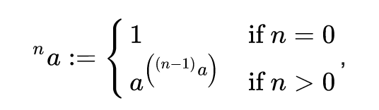
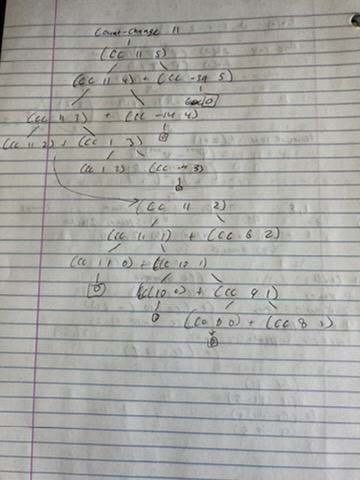

To install mit-scheme, I used:
```
brew install mit-scheme
```
Then to run the scheme repl, run:
```
scheme
```
Easy!
## Exercise 1.1


`10` \
10

`(+ 5 3 4)`\
 12

`(- 9 1)`\
8

`(/ 6 2)` \
3

`(+ (* 2 4) (- 4 6))`\
6

`(define a 3)`\
 a

`(define b(+ a 1))`\
b

`(+ a b (* a b))`\
19

`(= a b)`\
 #f (False)

```
(if (and (> b a) (< b (* a b)))
    b
    a)
```
4

```
(cond ((= a 4) 6)
      ((= b 4) (+ 6 7 a))
      (else 25))
```
16

`(+ 2 (if (> b a) b a))`\
6 

```
(* (cond ((> a b) a)
         ((< a b) b)
         (else -1))
   (+ a 1))
```
16

## Exercise 1.2

```
(/ (+ 5 4 (- 2 (- 3 (+ 6 (/ 4 5)))))
   (* 3 (- 6 2)(- 2 7)))
```
Not sure of the cleanest way to format this, so I grouped the expressions like the original fraction.
Evaluates to -37/150

## Exercise 1.3
```
(define (square x) (* x x))

(define (sum-of-squares x y) 
    (+ (square x) (square y)))

(define (sum-squares-two-largest x y z)
    (cond ((and (<= x y) (<= x z)) (sum-of-squares y z))
          ((and (<= y x) (<= y z)) (sum-of-squares x z))
          ((and (<= z x) (<= z y)) (sum-of-squares x y))))
```

## Exercise 1.4

```
(define(a-plus-abs-b a b)
   ((if (> b 0) + -) a b))
```
The function name gives it away: Add to a the absolute value of b. If b is positive add it to a, but if negative, cancel the negative by subtracting. 

## Exercise 1.5

```
(define (p) (p))

(define (test x y)
  (if (= x 0) 0 y))

```
Applicative-order evaluation:
```
(test 0 (p))
```
Because evaluation is first, we don't get past this expression, because we have never finished defining p. Running this in the scheme interpreter, it just gets stuck. As hinted in the text, this does not yield a legitimate value.

Normal-order evaluation:
```
(test 0 (p))
(if (= 0 0) 0 (p)))
0
```
We get zero with normal-order evaluation because we don't have to evaluate to reach the output 0.

## Exercise 1.6
When running the command with the new-if definition, I get the error message:
`;Aborting!: maximum recursion depth exceeded`\
My guess to explain this would be that by defining our if in terms of condition, we don't ever reach a terminating point, a stopping clause in our recursion. Maybe also something to do with normal-order versus applicative order application also.

## Exercise 1.7
Small number where our function sucks: 
```
(sqrt 1/10000)
;Value: .03230844833048122
```
In reality our square root is 0.01.

Large number where our function sucks:\
`(sqrt 10000000000000)` (10 trillion)\
It doesn't evaluate immediately, and once my fan started running I killed the repl. It works with 1 trillion, but 10 trillion seems to put it over the edge. 

### New and improved sqrt

```
(define (sqrt-iter guess prev-guess x)
  (if (good-enough? guess prev-guess)
      guess
      (sqrt-iter (improve guess x) guess
                 x)))

(define (improve guess x)
  (average guess (/ x guess)))

(define (average x y)
  (/ (+ x y) 2))


(define (good-enough? guess prev-guess)
  (< (abs (- guess prev-guess)) (fraction guess)))

(define (fraction guess)
    (* guess 1/100000))

(define (sqrt x)
  (sqrt-iter 1.0 2.0 x))
```
This was tricky but satisfying. Coming from a procedural background, I was stuck thinking about how to pass on the previous iteration's variable through recursion. I added a pre-guess variable to the sqrt-iter function's arguments and iniatialize the pre-guess to 2.0 (but really any number that's not the same as the guess will do). 

I then pass along guess in the recursive call in the prev-guess argument. So now, each call of the sqrt-iter takes in the improved guess and the prev-guess. 

For the good-enough? function, we are now checking that the change between the previous and improved guess is greater then a small fraction of the guess. I probably could have kept used one expression, but I decided to create a fraction function just for practice. I used 1/100000, which seemed to work pretty well. 

Testing it out:
```
(sqrt 1/10000)
;Value: .01
```
```
(sqrt 10000000000000)
;Value: 3162277.6601683795
```
It works now!

## Exercise 1.8

```
(define (cube-iter guess prev-guess x)
  (if (good-enough? guess prev-guess x)
      guess
      (cube-iter (improve guess x) guess
                 x)))

(define (improve guess x)
  (/ (+ (/ x (square guess)) (* 2 guess))3)
)

(define (good-enough? guess prev-guess x)
  (< (abs (- guess prev-guess)) (fraction guess)))

(define (fraction guess)
    (* guess 1/100000))

(define (cube x)
  (cube-iter 1.0 2.0 x))
```
## Exercise 1.9
```
(define (+ a b)
  (if (= a 0)
      b
      (inc (+ (dec a) b))))

(+ 4 5)
(inc (+ (dec 4) 5))
(inc (inc (+ (dec 3) 5)))
(inc (inc (inc (+ (dec 2) 5))))
(inc (inc (inc (inc (+ (dec 1) 5)))))
(inc (inc (inc (inc (+ 0 5)))))
(inc (inc (inc (inc 5))))
(inc (inc (inc 6)))
(inc (inc 7))
(inc 8)
9
```
Based on the increasing length of our deferred operations, and a clear stopping condition, this is a recursive procedure.

```
(define (+ a b)
  (if (= a 0)
      b
      (+ (dec a) (inc b))))

(+ 4 5)
(+ (dec 4) (inc 5))
(+ (dec 3) (inc 6))
(+ (dec 2) (inc 7))
(+ (dec 1) (inc 8))
(+ 0 9)
9
```
Because we only keep track of two state variables, and don't perform deferred operations, this a linear iterative process.

## Exercise 1.10
```
(A 1 10)
1024
(A 2 4)
65536
(A 3 3)
65536

(define (f n) (A 0 n))
(define (g n) (A 1 n))
(define (h n) (A 2 n))
```
The f function is 2n. It's easy to see from the condition ((= x 0) (* 2 y)).
The g function computes 2^n. Hard to tell from reading the function definition, but after trying out values its clear. 

For function h, for inputs [1, 2, 3, 4, 5] -> [2, 4, 16, 65536, then a number that 19729 *digits* long!]

This is the tower function, where n corresponds to how many times we exponentiate 2. The recursive definition for this is:



## Exercise 1.11

Recursive version basically wrote itself, but takes forever to even compute n = 100.
```
(define (func n)
  (if (< n 3)
    n
   (+ (func (- n 1)) (* 2 (func (- n 2))) (* 3 (func (- n 3))))
  )
)
```

Iterative version took an hour to figure out, mainly just writing on paper what the calculations were. There are only 3 state variables needed, and I first check if n < 3, and if not, then I use the func2_iter() with the starting inialization at 2, 1, 0. I then compute similarly to the recursive function to update a, then swap b=a, and c=b. For n to be the correct number of iterations, we have to start at n - 2 since we check if less than 3 at the beginning, effectively checking for the first two iterations.

Now, n = 100 is instantaneous. 

```
(define (func2 n)
  (if (< n 3)
    n
    (func2_iter 2 1 0 (- n 2)))
)

(define (func2_iter a b c count)
  (if (= count 0)
    a
    (func2_iter (+ a (* 2 b) (* 3 c)) a b (- count 1))
  )
)
```

## Exercise 1.12

The hardest part about this problem was figuring out how to represent the arguments. I tried with just one argument n, but that was too hard. 
Eventually, I found that using the row and the col to find an element was the easiest way to represent the process. 

There are two base cases:
  - If the row and col are equal, that means you are at the right edge of the triangle, so you're 1 
  - If the col is equal to 1, that means you are at the left edge of the triangle, so you're 1

The top of the triangle satisfies either. 
Then the recursive step equivalent to adding the two elements above is:

pascal(row above, one column left) + pascal(row above, same column)

```
(define (pascal row col)
  (cond ((= row col) 1)
        ((= col 1) 1 )
        (else (+ (pascal (- row 1) (- col 1)) (pascal (- row 1) col)))
  )
)
```
## Exercise 1.13
Coming back to this one later.

## Exercise 1.14
My attempt to start drawing the calls for count-change is pictured. They kind of gave it away in the chapter that there is an exponential number of calls to the cc function. Something like O(a^k) for time complexity. There are two recursive calls, and to get to the bottom of the first branch we need to reach the bottom of the kinds-of-coins, which is k. The second branch for each call needs to reach the bottom of the amount, a. Still wrapping my mind about that one.

 The space complexity (the number of levels in the tree) is O(n). This is because the number of levels (the height) in a binary tree is related to the number of nodes in a tree. The relationship between the number of nodes and the height of a binary tree is (at most) num_nodes = 2^(h + 1) - 1, where h is the height. 
With big O this is num_nodes = 2^h. Since num_nodes is bounded by 2^n, we can see that 2^n = 2^h, so the height is the n, the size of the input, or in this case, the number of cents we want change for.




## Exercise 1.15
a. Based on the substitution model, the procedure p will be applied 5 times:

```
(sine 12.15)
(p (sine 4.05))
(p (p (sine 1.35)))
(p (p (p (sine 0.45))))
(p (p (p (p (sine 0.15)))))
(p (p (p (p (p (sine 0.05))))))
```

b. For complexity, we essentially are counting how many times we need to divide our number, which means we need a log, O(log(n)). Becuase there is only one recursive call each time, the space and time complexity are equivalent. 

## Exercise 1.16

I stuggled with a couple different approaches, and ended up consulting Knuth's Art of Programming Vol 2 section 4.6.3 for the algorithm, which I went through to make sure I understood, then implemented it in scheme. From the problem description, I was confused about what "define the state transformation in such a way that the product a * bn is unchanged from state to state", but now I understand that a * bn is always equal to the final answer, but you are changing the values of a, b, and n with each iteration. 

Here's an example for 2^9. At each iteration the product a * b^n is always 512:


| a      | b^n     | 
| :------------- | :----------: |
| 1 | 2^9   |
| 2 | 16^2 |
| 2 | 256^1 |
| 512 | 256^0 |

```
(define (expt b n)
  (expt-iter b n 1))

(define (expt-iter b n a)
  (cond ((= n 0) a)
        ((even? n) (expt-iter (square b) (/ n 2) a))
        (else (expt-iter (square b) (floor (/ n 2)) (* a b)))       
  ) 
)
```
At each iteration, we square b (the base), and use floor division for n if n is odd. We check if n is even, then we update a by multiplying it by b. 

## Exercise 1.17
This was pretty straightforward, since it's the same abstraction as expt. Where we squared in expt, now we double, and where we multiplied in expt, now we add. I first made the mistake of defining double with *, which was circular and stunted the program at runtime. Instead we have to define double with +. 
```
(define (* a b)
  (cond ((= b 0) 0)
        ((even? b) (double (* a (halve b))))
        (else (+ a (* a (- b 1))))
  )        
)

(define (double x)
  (+ x x))

(define (halve x)
  (/ x 2))
```
## Exercise 1.18
This basically involved switching square with double, * with +, / with halve, and making sure the state variable starts at 0 instead of 1. I'm also using "result" to be the state variable "a" from the expt-iter function, because we're already using "a" as a variable for the input.

Looking into Knuth's AOP vol 2 section 4.6.3, (page 443) he also notes the same differences in the exponential algorithm with the Russian peasant method for multiplcation. Looks like the SICP authors just sourced these exercises from the AOP chapter. However, the Scheme implementation to me is much clearer than Knuth's description of the algorithm.
```
(define (* a b)
  (mult-iter a b 0))

(define (mult-iter a b result)
  (cond ((= a 0) result)
        ((even? a) (mult-iter (halve a) (double b) result))
        (else (mult-iter (floor (halve a)) (double b) (+ b result)))       
  ) 
)
```

## Exercise 1.19
Once I figured out what the question was asking, this turned out just to be some algebra. Since it doesn't matter whether we solve with a or b, I solved with b as it has less terms. For the equation b = bp + aq, we plug in for b the same equation, and we plug in a as a = bq + aq + ap. Then we factor to get a and b by itself, to follow the form of b = bp + aq, and whatever we have mutliplied by b and a is our p' and q'

b = bp + aq 

T(b) = (bp + aq)p + (bq + aq + ap)q

= bp^2 + apq + bq^2 + aq^2 + apq

= bp^2 + bq^2 + apq +aq^2 + apq

= b(p^2 + q^2) + a(pq + q^2 + pq)

= b(p^2 + q^2) + a(2pq + q^2)

So p' = p^2 + q^2, and q' = 2pq + q^2.

 In Scheme:

```
p' = (+ (square p) (square q))
q' = (+ (* 2 p q) (square q))   
```
The final logarithmic fib function is then:
```
(define (fib n)
  (fib-iter 1 0 0 1 n))
(define (fib-iter a b p q count)
  (cond ((= count 0) b)
        ((even? count)
         (fib-iter a
                   b
                   (+ (square p) (square q))
                   (+ (* 2 p q) (square q))   
                   (/ count 2)))
        (else (fib-iter (+ (* b q) (* a q) (* a p))
                        (+ (* b p) (* a q))
                        p
                        q
                        (- count 1)))))
```

## Exercise 1.20
Normal Order: (Expand then apply) There is a total of 14 calls to remainder with normal order.
```
(gcd 206 40)
(gcd 40 (remainder 206 40)) # 1 remainder operation for if
(gcd (remainder 206 40) (remainder 40 (remainder 206 40))) # 2 remainder operations for if
(gcd (remainder 40 (remainder 206 40)) (remainder (remainder 206 40) (remainder 40 (remainder 206 40)))) # 4 remainder operations
(gcd (remainder (remainder 206 40) (remainder 40 (remainder 206 40))) (remainder
                                                                          (remainder 40 (remainder 206 40)) 
                                                                          (remainder (remainder 206 40) 
                                                                          (remainder 40 (remainder 206 40))))) # 7 calls to remainder
```
Applicative order: (Apply immediatley) There is a total of 4 calls to remainder with applicative order. Quite a difference. 
```
(gcd 206 40)
(gcd 40 (remainder 206 40)) 
(gcd 40 6) # 1
(gcd 6 (remainder 40 6)) 
(gcd 6 4) # 2
(gcd 4 (remainder 6 4)) 
(gcd 4 2) # 3
(gcd  2 (remainder 4 2)) 
(gcd  2 0) # 4 
(2) 
```

## Exercise 1.21
199 and 1999 are prime, while 19999 is not prime.
```
(smallest-divisor 199)

;Value: 199

(smallest-divisor 1999)

;Value: 1999

(smallest-divisor 19999)

;Value: 7
```

## Exercise 1.22
This is how I interpreted the instructions for the search-for-primes procedure:
```
(define (search-for-primes x y)
  (timed-prime-test x)
  (cond ((> x y) (display "end"))
        ((even? x) (search-for-primes (+ x 1) y))
        (else (search-for-primes (+ x 2) y))))
```
x is the start and y is the end. There doesn't seem to be 
a difference is timing for numbers at 1000 or 1,000,000, but there is at 1 billion and 1 trillion. I'm guessing that due to the improvements in hardware since this book was written, there is now hardly a difference for comparsions between search-for-primes at 10 and 1000.

Here is the output for the three smallest primes larger than 1000.

```
(search-for-primes 1000 1100)
1000
1001
1003
1005
1007
1009 *** 0.
1011
1013 *** 0.
1015
1017
1019 *** 0.
```

Here is the output for the three smallest primes larger than 1,000,000:
```
(search-for-primes 1000000 1000100)
1000000
1000001
1000003 *** 0.
1000005
1000007
1000009
1000011
1000013
1000015
1000017
1000019
1000021
1000023
1000025
1000027
1000029
1000031
1000033 *** 0.
1000035
1000037 *** 0.
```

When I try at 1 billion there is a time differential:
```
(search-for-primes 1000000000 1000000100)

1000000000
1000000001
1000000003
1000000005
1000000007 *** .02999999999999403
1000000009 *** 2.0000000000003126e-2
1000000011
1000000013
1000000015
1000000017
1000000019
1000000021 *** 2.0000000000003126e-2
```

Here is 10 times that, at 1 trillion:
```
(search-for-primes 1000000000000 1000000000100)

1000000000039 *** .730000000000004
1000000000041
1000000000043
1000000000045
1000000000047
1000000000049
1000000000051
1000000000053
1000000000055
1000000000057
1000000000059
1000000000061 *** .7299999999999969
1000000000063 *** .730000000000004
```
Now its easier to compare the difference. This is close to sqrt(10) times longer:

0.02 x sqrt(10) = 0.063.

So it looks like the machine runs in time proportional to the number of steps required for the computation.

## Exercise 1.23
Here are the updates to the smallest-divisor procedure:
```
(define (next x)
  (if (= x 2) 3
      (+ x 2)))

(define (smallest-divisor n)
  (find-divisor n 2))
(define (find-divisor n test-divisor)
  (cond ((> (square test-divisor) n) n)
        ((divides? test-divisor n) test-divisor)
        (else (find-divisor n (next test-divisor)))))
(define (divides? a b)
  (= (remainder b a) 0))
```
Testing at 1 billion, there is not much of a difference:
```
(search-for-primes 1000000000 1000000100)

1000000000
1000000001
1000000003
1000000005
1000000007 *** 2.0000000000003126e-2
1000000009 *** .01999999999999602
1000000011
1000000013
1000000015
1000000017
1000000019
1000000021 *** 2.0000000000003126e-2
```
At 1 trillion we can see the difference:
```
(search-for-primes 1000000000000 1000000000100)
1000000000039 *** .45999999999999375
1000000000041
1000000000043
1000000000045
1000000000047
1000000000049
1000000000051
1000000000053
1000000000055
1000000000057
1000000000059
1000000000061 *** .46000000000000085
1000000000063 *** .46999999999999886
```
For 1 trillion, the execution time is now roughly 1.65 times faster:

0.76/0.46 = 1.65

So not quite 2. This is due to the fact that we have added an additional procedure call with next, as well as checking an if statement in the next procedure.

Just for fun, I also tried this updated procedure at 1 quadrillion:
```
(search-for-primes 1000000000000000 1000000000000100)
1000000000000037 *** 14.399999999999991
1000000000000091 *** 14.519999999999996
```
We'll use this to compare with the fermat test version.

## Exercise 1.24
Running the quadrillion test with fast-prime, where in the fast-prime? procedure we set the argument "times" to 100:
```
(search-for-primes 1000000000000000 1000000000000100)
1000000000000037 *** .01999999999999602
1000000000000091 *** 1.0000000000005116e-2
```
Now the test is 1,400 times faster! 1 trillion also is around 0.01, so it is hard to compare. I assume the growth is (Olog(n)), and any discrepency is due to implementation details.


## Exercise 1.25
This version of expmod is much slower because it first has to compute the base^exp, which can be extremely large. The orginial expmod procedure never explicitly computes this number, instead it uses successive squaring that ensures we decrease the exponential recusrivusly before using it with a base. 

## Exercise 1.26
By not calling square, we instead are making two recursive calls to expmod, making this a tree recursive process. Because Scheme is applicative order, now it must evalute both calls to expmod before making each recursive call. 

By making two recursive calls, we are cancelling out the benefit we recieved with succesive squaring, creating an O(n) runtime.

Instead of T(n) = 1 + T(n/2), which evaluates to O(log n), where we cut amount of work in half with each even call, 
we now instead have T(n) = 1 + T(n/2) + T(n/2), which evaluates to O(n)

## Exercise 1.27
Here is my implementation of a test to check for a carmichael number:
```
(define (carmichael n)
  (carmichael-iter n 2))

(define (carmichael-iter n a)
  (cond ((= a n) true)
        ((= (expmod a n n) a) (carmichael-iter n (+ a 1)))
         (else false)
  )
)
```
Starting at 2, I check if all the positive integers below n are satisfy a^n mod n = a. If we reach n, and if the input number if not prime, then we have found a carmichael number. 561 is an example:
```
(smallest-divisor 561)
;Value: 3

1 ]=> (carmichael 561)

;Value: #t
```
561 is not prime because it is divisible by 3, yet it satisfies the property a^n mod n = a for all a < n.

## Exercise 1.28
Here are the functions necessary to implement the miller-rabin test. We first change the fermat test to check if expmod a^(n-1) mod n is equal to 1 mod n. 
We implement non-trivial-square-root, which first checks if the number we're looking at is 1 or n - 1, and if its not, check if its square is equal to 1 mod n. 
We use non-trivial-square-root in expmod, and we check before we square the number if it is a non-trival square root. If it is, we return 0. We then call our miller-rabin-test in fast-prime?. 

```

(define (miller-rabin-test n)
  (define (try-it a)
    (= (expmod a (- n 1) n) (remainder 1 n)))
  (try-it (+ 1 (random (- n 1)))))

(define (non-trivial-square-root x n)
  (if (or (= x 1) (= x (- n 1))) false
  (= (square x) (remainder 1 n)))
)


(define (expmod base exp m)
  (cond ((= exp 0) 1)
        ((even? exp)
        (if (non-trivial-square-root (expmod base (/ exp 2) m) m) 0 
         (remainder (square (expmod base (/ exp 2) m))
                    m)))
        (else
         (remainder (* base (expmod base (- exp 1) m))
                    m))))     

(define (fast-prime? n times)
  (cond ((= times 0) true)
        ((miller-rabin-test n) (fast-prime? n (- times 1)))
        (else false)))
```
Testing for the carmichael numbers given in the footnotes:

```
1 ]=> (fast-prime? 561 10)

;Value: #f

1 ]=> (fast-prime? 1729 10)

;Value: #f
```
Using 10 random numbers to test in fast-prime? gave false for the first 6 carmichael numbers.

## Exercise 1.29
My first attempt was trying to use the sum function defined in the chapter, but I couldn't figure out how to multiply the 2 and 4 
against each function call in the series. I rewrote it using an iterative accumulator function instead. I start with k = 1, and start the result as f(a), since y0 always cancels out the kh term in f(a + kh) (k is 0). The conditionals are to check whether we are on the last term of the series, or if we are on an odd or even term. If even we multiply the function by 2, else by 4.

For n = 100, 1000 I get 1/4. I don't think this
is the most elegant solution. I read ahead and used the "let" statement for the local variable h to simplify the simpsons-rule function.
```
(define (simpsons-rule f a b n)
(let ((h (/ (- b a) n)))
  (* (/ h 3) (simpson-iter f a 1 h n (f a)))))

(define (simpson-iter f a k h n result)
  (cond ((> k n) result)
        ((= k n) (simpson-iter f a (+ k 1) h n (+ result (f (+ a (* k h))))))
        ((even? k) (simpson-iter f a (+ k 1) h n (+ result (* 2 (f (+ a (* k h)))))))
        (else (simpson-iter f a (+ k 1) h n (+ result (* 4 (f (+ a (* k h)))))))
  )
)

1 ]=> (simpsons-rule cube 0 1 100)

;Value: 1/4

1 ]=> (simpsons-rule cube 0 1 1000)

;Value: 1/4
```

## Exercise 1.30
This was pretty straight forward (compared to the last exercise).
```
(define (sum term a next b)
  (define (iter a result)
    (if (> a b)
        result
        (iter (next a) (+ result (term a)))))
  (iter a 0))
```

## Exercise 1.31
Modified the sum fuction with *, and for factorial, started multiplying from 1 to n.
```
 (define (product term a next b)
  (if (> a b)
      1
      (* (term a)
         (product term (next a) next b))))
        
(define (factorial n)
  (define (inc n) (+ n 1))
  (define (identity x) x)
  (product identity 1 inc n))
```
Couldn't figure out the pi formula, I'll come back to that later.

## Exercise 1.32
This was straightforward, just had to modify the iterative sum from exercise 1.30.
```
(define (product term a next b)
  (define (iter a result)
    (if (> a b)
        result
        (iter (next a) (* result (term a)))))
  (iter a 1))
```
Here is a recursive accumulate fuction. The combiner for product or sum is * or +, and for null-value 1 or 0 respectively.
```
(define (accumulate combiner null-value term a next b)
  (if (> a b)
  null-value 
    (combiner (term a)
              (accumulate combiner null-value term (next a) next b))))
```
Here is an example test for the accumulate function:
```
1 ]=> (accumulate + 0 cube 1 inc 10)

;Value: 3025
```
Here is the iterative accumulate function:
```
(define (accumulate combiner null-value term a next b)
  (define (iter a result)
    (if  (> a b)
    result
      (iter (next a) (combiner result (term a)))))
  (iter a null-value))
```

## Exercise 1.33 
Here is a recursive filtered-accumulate. The only difference from the accumulate is that there is a condional check at each step whether the condition is satisfied.
```
(define (filtered-accumulate combiner null-value term a next b filter)
  (cond ((> a b) null-value)
  ((filter a) (combiner (term a)
  (filtered-accumulate combiner null-value term (next a) next b filter)))
  (else (filtered-accumulate combiner null-value term (next a) next b filter))))
```
a) Here is the result  of the sum of squares of the prime numbers in a given range:
```
1 ]=> (filtered-accumulate + 0 square 2 inc 9 prime?)

;Value: 87
```
b) For the relatively-prime filter, I modified filtered-accumulate so that it takes two parameters for the filter.
```
(define (gcd a b)
  (if (= b 0)
      a
      (gcd b (remainder a b))))

(define (gcd-filter i n)
  (= (gcd i n) 1))

(define (filtered-accumulate combiner null-value term a next b filter)
  (cond ((>= a b) null-value)
  ((filter a b) (combiner (term a)
  (filtered-accumulate combiner null-value term (next a) next b filter)))
  (else (filtered-accumulate combiner null-value term (next a) next b filter))))
```
Here is an example using the function. I'm using identity and inc, which we've defined before. The only numbers that have a GCD of 1 with 8 is 3,5 and 7, whose product is 105.
```
1 ]=> (filtered-accumulate * 1 identity 1 inc 8 gcd-filter)

;Value: 105
```
## Exercise 1.34
When running (f f), we recieve the error "the object 2 is not applicable" This is because the second argument
as itself evaluates to 2, which is then applied as an operater in the final f, but because 2 is a primitive, we cannot use it as a function.

## Exercise 1.35
A fixed point is when f(x) = x. In this case f(x) is x -> 1 + 1/x, so if we plug in $\phi$ and receive the same value, then it is a fixed point of f(x). Here's the algebra:
$$ \phi = \frac{1 + \sqrt{5}}{2} $$
$$ f(\phi) = 1 +  \frac{2}{1 + \sqrt{5}} $$
$$ = 1 + \frac{2(1 - \sqrt{5})}{(1 + \sqrt{5})(1 - \sqrt{5})}$$
$$ = 1 + \frac{2  -2\sqrt{5}}{-4}$$
$$ = 1 - \frac{1}{2} + \frac{\sqrt{5}}{2}$$
$$ = 1 + \frac{-1 + \sqrt{5}}{2}$$
$$ = \frac{1 + \sqrt{5}}{2}$$

Here is the computation of $\phi$ with fixed-point, and a starting guess of 1:
```
1 ]=> (fixed-point (lambda (x) (+ 1 (/ 1 x))) 1.0))

;Value: 1.6180327868852458
```

## Exercise 1.36
Here is the modified fixed-point with newline and display:
```
(define tolerance 0.00001)
(define (fixed-point f first-guess)
  (define (close-enough? v1 v2)
    (< (abs (- v1 v2)) tolerance))
  (define (try guess)
    (let ((next (f guess)))
    (newline)
    (display next)
      (if (close-enough? guess next)
          next
          (try next))))
  (try first-guess))
```
Without average damping, fixed-point takes 33 guesses when starting with guess 2:
```
1 ]=> (fixed-point (lambda (x) (/ (log 1000) (log x))) 2)

9.965784284662087
3.004472209841214
6.279195757507157
3.759850702401539
5.215843784925895
4.182207192401397
4.8277650983445906
4.387593384662677
4.671250085763899
4.481403616895052
4.6053657460929
4.5230849678718865
4.577114682047341
4.541382480151454
4.564903245230833
4.549372679303342
4.559606491913287
4.552853875788271
4.557305529748263
4.554369064436181
4.556305311532999
4.555028263573554
4.555870396702851
4.555315001192079
4.5556812635433275
4.555439715736846
4.555599009998291
4.555493957531389
4.555563237292884
4.555517548417651
4.555547679306398
4.555527808516254
4.555540912917957
4.555532270803653
;Value: 4.555532270803653
```
To make an average damping version of this function, we take the average of the original function and x. This cuts down the number of guesses from 33 to 8:
```
(define (average x y)
  (/ (+ x y) 2))

1 ]=> (fixed-point (lambda (x) (average (/ (log 1000) (log x)) x)) 2)

5.9828921423310435
4.922168721308343
4.628224318195455
4.568346513136242
4.5577305909237005
4.555909809045131
4.555599411610624
4.5555465521473675
4.555537551999825
;Value: 4.555537551999825
```

## Exercise  1.37
Here is a recursive implementation of cont-frac:
```
(define (cont-frac n d k)
  (define (cont-frac-iter n d k i)
    (if (> i k)
      0
      (/ (n i) (+ (d i) (cont-frac-iter n d k (+ i 1))))))
  (cont-frac-iter n d k 1))
```
K must be 12 to approxmiate the golden ration to 4 decimal places:
```
1 ]=> (/ 1.0 (cont-frac (lambda (i) 1) (lambda (i) 1) 11))

;Value: 1.6179775280898876

1 ]=> (/ 1.0 (cont-frac (lambda (i) 1) (lambda (i) 1) 12))

;Value: 1.6180555555555554
```

Here is the iterative implementation of cont-frac (sorry for the same naming..). The results are the same, with k=12 being enough for 4 decimal places.
```
(define (cont-frac n d k)
  (define (cont-frac-iter n d k result)
    (if (= k 0)
    result
    (cont-frac-iter n d (- k 1) (/ (n k) (+ result (d k))))))
  (cont-frac-iter n d k 0))
```
This was interesting because to me it made more sense for the accumulations to start from the end (the "bottom" of the continued fraction), and build back up, compared to the recursive version, which starts from the top, and accumlates down the continued fraction.

## Exercise 1.38
The fun of this exercise was figuring out how to express $D_{i}$ as a function of i. The solution I came up is a little strange, but I like its jankiness. 

```
(define (d-func i)
  (cond ((< i 3) i)
        ((or (= 0 (remainder i 3)) (= 1 (remainder i 3))) 1)
        (else (- i (/ (- i 2) 3)))))
```
I looked at the pattern 1, 2, 1, 1, 4, 1, 1, 6, 1, 1, 8, and saw that if we give each number an index starting at 1, I could calculate the non 1's by subtracting 2 from the requested index, divide the result number by 3, and then finally subtract that result from the request index. That's a lot, its easier to see with some examples:


$$i = 8 \ (should\ return \ 6) $$
$$8 - 2 = 6$$
$$6 / 3 = 2$$
$$8 - 2 = 6$$
$$return \,6$$
$$i = 11 \ (should \ return \ 8)$$
$$11 - 2 = 9$$
$$9 / 3 = 3$$
$$11 - 3 = 8$$
$$return \ 8$$

For the numbers less than 3, I return i, and for the rest of the numbers, I check if that number mod 3 is 0 or 1, and if it is I return 1. 

I wrote a loop to make sure its doing what I think:
```
(define (d-func-iter i k)
  (newline)
  (display (d-func i))
  (if (= i k)
    (display 'done)
    (d-func-iter (+ i 1) k)))
```
```
1 ]=> (d-func-iter 1 14)

1
2
1
1
4
1
1
6
1
1
8
1
1
10done
;Unspecified return value
```
Finally, here is the approximation of $e$ using cont-frac:
```
1 ]=> (+ (cont-frac (lambda (i) 1) d-func 10) 2.0)

;Value: 2.7182817182817183
```
Phew, it works! I add two because this continued fraction expansion is for  $e - 2$.

## Exercise 1.39
This one took a little longer than I thought, but only because I made the silly mistake of swapping d with n.
```
(define (tan-cf x k)
  (define (cont-frac n d k)
    (define (cont-frac-iter n d k i)
      (if (> i k)
        0
        (/ (n x i) (- (d i) (cont-frac-iter n d k (+ i 1))))))
    (cont-frac-iter n d k 1))
  (define (n-func x i)
    (if (= i 1)
      x
      (square x)))
  (cont-frac n-func (lambda (i) (- (* 2 i) 1)) k))
```
Here it is working for 0, $\frac{\pi}{6}$, $\frac{\pi}{4}$, and $\pi$:
```
1 ]=> (tan-cf 0 10)

;Value: 0

1 ]=> (tan-cf (/ 3.14159 6) 10)

;Value: .5773496795031555

1 ]=> (tan-cf (/ 3.14159 4) 10)

;Value: .9999986732059835

1 ]=> (tan-cf 3.14159 10)

;Value: -2.6554829755074223e-6
```

## Exercise 1.40
```
(define (cubic a b c)
  (lambda (x) (+ (* x x x) (* a (square x)) (* b x) c)))
```

To test that it works, I used 
$$ x^{3} + 3x^{2} - 6x -18 $$

Which can be factored to

$$(x + 3)(x^{2} - 6)$$

So $\sqrt{6} \approx 2.449$ is a solution.

```
1 ]=> (newtons-method (cubic 3 (- 6) (- 18)) 1)

;Value: 2.449489742783251
```

## Exercise 1.41
```
(define (double f)
  (lambda (x) (f (f x))))
(define (inc x) (+ x 1))
```
```
1 ]=> (((double (double double)) inc) 5)

;Value: 21
```
The first (double double) adds 4 to argument given, but the third double squares 4, so it adds 16 + 5 = 21.

## Exercise 1.42
```
(define (compose f g)
  (lambda (x) (f (g x))))
```
```
1 ]=> ((compose square inc) 6)

;Value: 49
```

## Exercise 1.43
This one was trickier than I initially thought. My first try looked like this:
```
(define (repeated f n)
  (define (repeated-iter f i)
    (if (= i n)
      f
      (repeated-iter (compose f f) (+ i 1))))
  (repeated-iter f 1))
```
This worked for n = 2, but for n = 3 it got the wrong answer:
```
1 ]=> ((repeated square 3) 5)

;Value: 152587890625
```
It should be $5^{8} = 390,625$; instead it was skipping to $5^{16}$. 

The problem is in (compose f f). I'm using the previous function to nest, but because of the recursion, the previous function is a composed function, not the original! I needed to be clear about which function was being composed on the outside to fix it.
```
(define (repeated orig-func n)
  (define (repeated-iter nested-func i)
    (if (= i n)
      nested-func
      (repeated-iter (compose orig-func nested-func) (+ i 1))))
  (repeated-iter orig-func 1))
```
```
1 ]=> ((repeated square 3) 5)

;Value: 390625
```